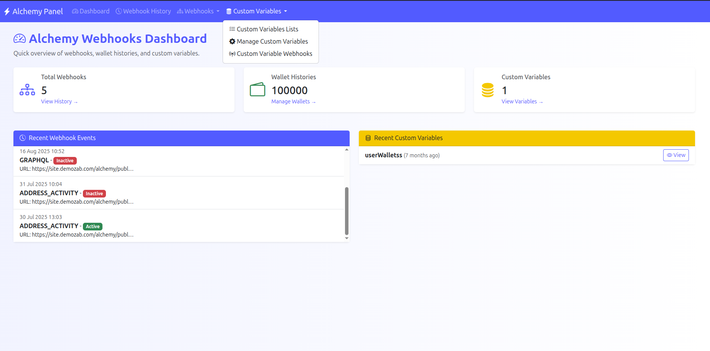
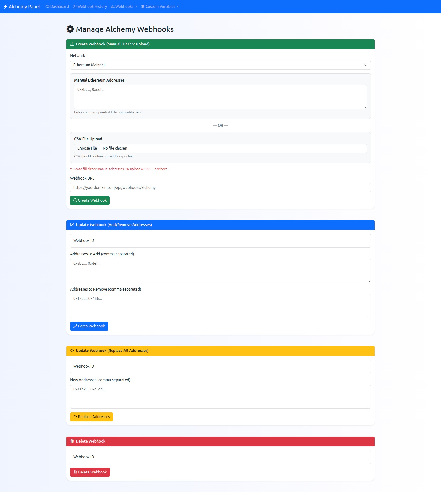
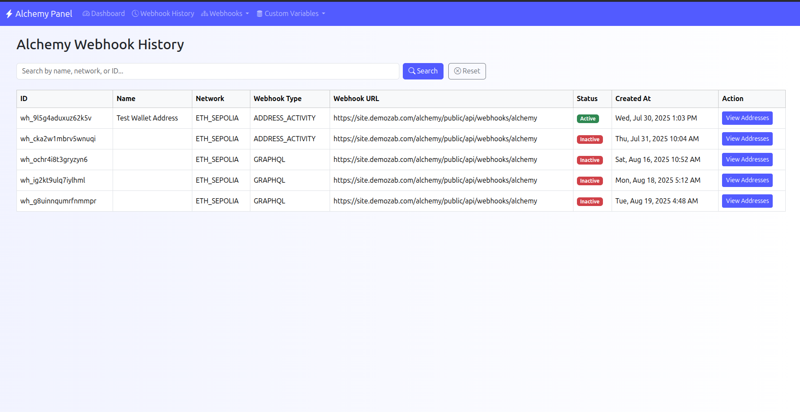
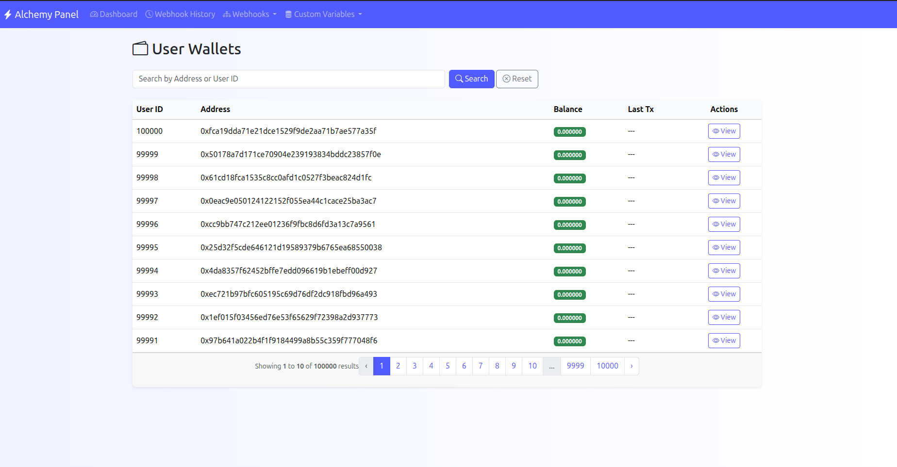
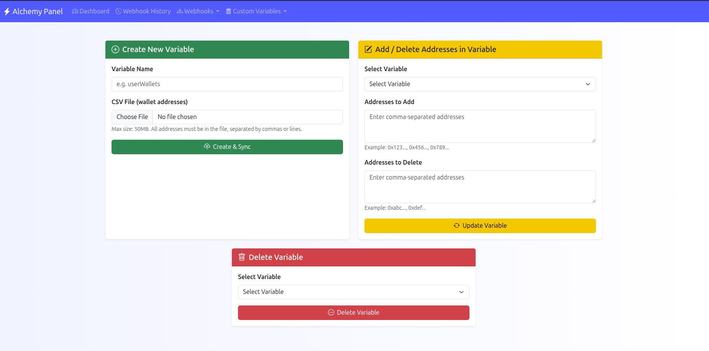
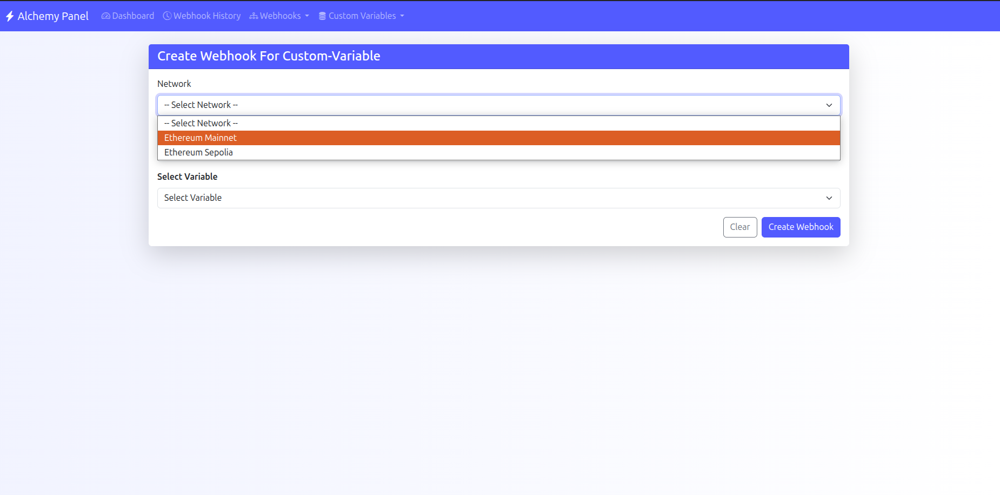

# Alchemy Webhooks Dashboard

Laravel application for managing Alchemy webhooks, wallet histories, and custom variables in one admin panel.

## Overview

This project provides a central place to:

- create and manage Alchemy webhooks
- view webhook activity history
- inspect wallet balances and transaction history
- create, sync, update, and delete custom variables
- create variable-based webhooks from stored address lists
- process webhook-driven wallet deposits through queued jobs

## Screenshots

### Dashboard



### Manage Webhooks



### Webhook History



### Wallet History



### Manage Custom Variables



### Create Custom Variables



## Features

- Dashboard with counts for webhooks, wallet histories, and custom variables
- Webhook management for create, patch, replace, and delete operations
- Webhook history view with search and address inspection
- Wallet list and per-wallet transaction timeline
- Custom variable creation from CSV uploads
- Custom variable sync and address management
- Variable-based webhook creation
- Alchemy API integration
- Queue support for background processing

## Tech Stack

- PHP 8.0.2+
- Laravel 9.x
- MySQL
- Redis for cache, sessions, and queues
- Predis client
- Laravel Horizon
- Bootstrap-based admin UI

## Requirements

- PHP 8.0.2 or newer
- Composer
- MySQL
- Redis server
- Node.js and npm if you need to build frontend assets

## Installation

1. Clone the repository.
2. Install PHP dependencies:

```bash
composer install
```

3. Copy the environment file:

```bash
cp .env.example .env
```

4. Generate the application key:

```bash
php artisan key:generate
```

5. Configure your `.env` values:

```env
APP_URL=http://localhost/TestWebhook/public

DB_CONNECTION=mysql
DB_HOST=127.0.0.1
DB_PORT=3306
DB_DATABASE=test_crypto_address
DB_USERNAME=root
DB_PASSWORD=

ALCHEMY_WEBHOOK_AUTH_TOKEN=your_token_here
ALCHEMY_WEBHOOK_BASE_URL=https://dashboard.alchemy.com
ALCHEMY_APP_ID=your_app_id_here
ALCHEMY_WEBHOOK_SECRET=your_webhook_secret_here

REDIS_HOST=127.0.0.1
REDIS_PORT=6379
REDIS_CLIENT=predis

QUEUE_CONNECTION=redis
CACHE_DRIVER=redis
SESSION_DRIVER=redis
```

6. Run migrations:

```bash
php artisan migrate
```

7. Seed sample wallet data if needed:

```bash
php artisan db:seed --class=UserWalletSeeder
```

8. Start the app:

```bash
php artisan serve
```

## Redis

This application expects Redis to be available locally when using the default `.env` values.

Start Redis on Ubuntu:

```bash
sudo apt update
sudo apt install redis-server
sudo systemctl enable --now redis-server
redis-cli ping
```

If Redis is not available, switch these drivers to non-Redis values for local development:

```env
QUEUE_CONNECTION=sync
CACHE_DRIVER=file
SESSION_DRIVER=file
```

Then clear cached config:

```bash
php artisan optimize:clear
```

## Useful Routes

- `/` or `/dashboard` - admin dashboard
- `/webhooks/history` - webhook history
- `/manage` - manage webhooks
- `/wallets` - wallet list
- `/variables/all` - custom variables list
- `/variables-manage` - create/update/delete variables
- `/variables/webhook/create` - create variable-based webhook

## API Endpoint

- `POST /api/webhooks/alchemy` - Alchemy webhook receiver

## Notes

- The project is built around Alchemy webhook workflows and wallet address collections.
- CSV uploads should contain wallet addresses, one per line or separated by commas depending on the form used.
- Make sure `storage/` and `bootstrap/cache/` are writable by the web server user.

## License

This project is licensed under the MIT license.
